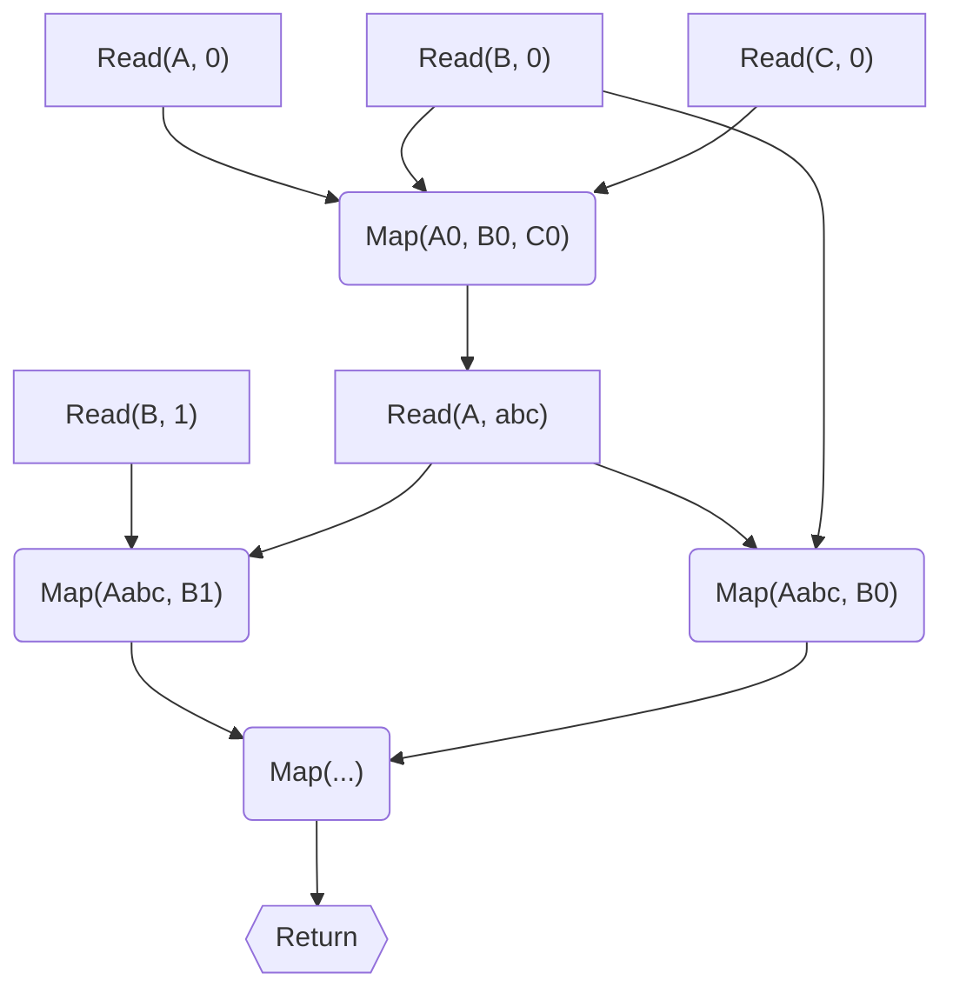

Journal 2020-02-27 - Batching External Calls and Marhsalling Operations
=======

Gosh, I don't even know where to start on this.  There's probably a bunch of things that already do this sort of thing that I don't even know about because I have no idea what to even look up.

Maybe as I start along and dig more into it, I'll come across things that point me in various directions, to various posts and papers to read.

My thought is that, currently when we want to make decisions based on remote data, we either make each call to the remote data as we need it, or we do some pre-work to determine what data we actually need before hand and make fewer calls for more data ahead of time, then make the decisions afterwards.

The main issue is that this nearly always results in mixing data retrieval with decision making, and means that the more performant way to do things can be sometimes quite different from the design specification we're trying to implement.

The issue with trying to move things around is that, often, any given parts of the process are dependent on previous parts of the process, since the point of prior steps is frequently to build the context required to execute those later steps.

One thought that comes to mind is that of dependency tracking: local operations and remote operations depend on prior operations, except for the initial-most operations which depend on nothing.  It seems then that you could define a lazy operation graph, the final operation (sink) being the return of some value (or throwing of some exception).  Mmmm graphs.

Another thought is you could learn Haskel, but very few corporations want to hire Haskellers.  That requires a special (read: expensive) kind of crazy.  Once you do that, everyone else approaching the codebase will come away babbling inchoately about monads and functors and have to be carted off to the funny farm.

Anyway.  The main commonality there is laziness: try to defer remote executions until you absolutely must make them so that, hopefully, you'll be able to get all the required data you need in one swell foop.  That's the idea, anyway.

But now I'm back at the problem of: where do I even start with this?  Well, abstract is hard and weird and my poor little brain can't really handle it starting out, so start with concrete examples.

## Trivial Example: Just a Single Entity

Let's say we just want to get a single entity by provided ID?

- Inputs:
    - Entity ID
- Process:
    - Select Entity from Entity Store where ID = Entity ID
    - Return Entity

That's about as simple as it gets.  Nothing much to say here, then.

## Trivial Example: Get Things Owned By Friends Of Entity

- Inputs:
    - Entity ID
- Process:
    - Select Entity as Friend from Entity Store where Friend Of ID = Entity ID
    - Select Thing from Thing Store where Owner ID = ID of Friend
    - Return Thing collection

Hm.  Not much else to say there.  That's two back-to-back queries, so that could actually be optimized down into one single one if you needed to.  The DB engine probably has a bunch of smarts already programmed into it to make such a query more optimal, too.

## What Am I Missing, Example Wise?

The thing which spawned this ponderance was a permissions type thing, but the permissions were predicated on quite a number of things.  Licensing, origin, etc.  I can't really just dump that process into this document, but I wonder if somethign close to it could be enough?

What else would be similarly complicated?  Copyrights?  Certainly with different nations having different copyright laws that would be complicated.

As for what it is generally that's actually necessary to build a sufficiently nasty thing to spawn these thoughts, I'm not sure exactly.  Something about prefetching data to make later queries easier, sure, but how do you construct something where that's necessary?  It might be because I'm thinking more in technical design rather than functional requirements that I'm not actually hitting my head against the wall I want to hit.

The other thing is, it's not just that the process itself was complicated and dependent on many data, but also that the implementation differed from the process as written, even if the end results were ultimately the same.  Unfortunately, I'm not very imaginative on that front, and you can't really beat reality.

Best case scenario would be to find some equivalent government classification process outline thing.

## Random Thoughts In The Mean Time

Okay, so I don't have any concrete examples to work on, which means it's hard to actually toy with things.  What about just random ideas that might help anyway?

### Random Thought 1: Reads, Writes, Maps

It seems there's only a few different things to worry about, generally:

- Reads
- Writes
- Maps

Writes weren't really considered in the original case, and I wonder just how different they are from Reads.  For instance, in one conception of how to handle HTTP requests, all HTTP requests are pretty much the same it's just that they probably have different parameters and some may have different HTTP methods.  That sort of difference or non-difference.

I suppose for the sake of example, then, I'll just ignore Writes for now.

I also suppose that it'll help to put off actual combining of API calls into a single one for later, just pretend for now it's handled.  That both lets us move forward on this part and forces proper separation of concerns anyway.

The question then becomes: how do we know when to make calls?  Or, how do we know our computation is stalled and we really do need to reach out?  Or can we determine by analysis of stated operations when we need to make what calls?

Okay, the question became a few different questions, but the last one makes me think back to the original statement that it could be conceived of as a directed graph.

Suppose this graph of Reads and Maps:

Just looking at it, it seems you'd be able to simply execute all source Reads, then just compute all dependent Maps that have no other Reads they depend on, then execute any more Reads, then more Maps, etc, etc.

In the above, you'd end up with these sets of executions:

1. Read(A, 0), Read(B, 0, 1), Read(C, 0)
2. Map(A0, B0, C0)
3. Read(A, abc)
4. Map(Aabc, B1), Map(Aabc, B2)
5. Map(...)
6. Return

Hm.  Looking at that, that is still better since we can state "Read(B, 1)" anywhere else and actual execution will still occur on the first step, but this doesn't handle the case of things like "Read all of (A) because we know we'll need them later".  In that case, I'm not sure you can actually can determine this up front, since the exact items you need to read for "Read(A, abc)" are unknown until you've done "Map(A0, B0, C0)".

#### Is That Actually Sufficient?

The actual implementation, or at least what I recall for why it differed in exact order of operations from the procedure as stated, it was stated that many items were fetched before hand because it was determined from prior analysis that that is more efficient because it's a single call with mulitple data.  Of course, without the actual implementation, I don't know how that worked, and without the actual original process document, I don't know how it differed.

Ugh, anonying.
